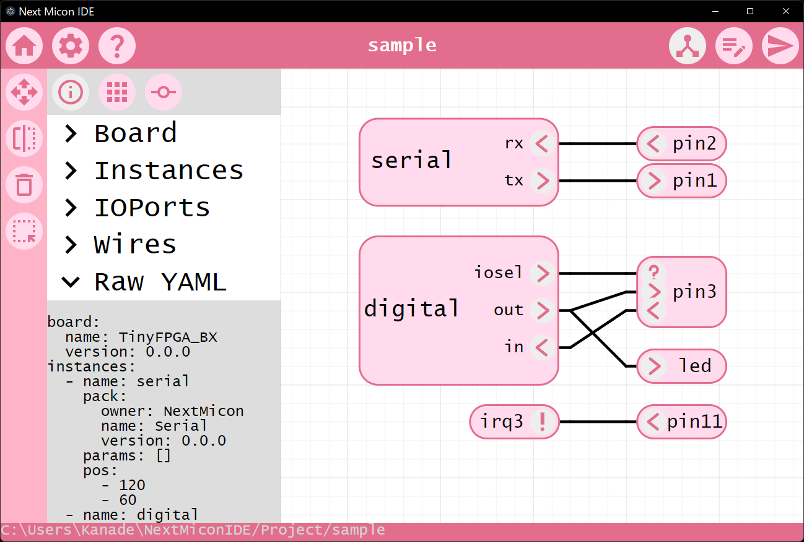
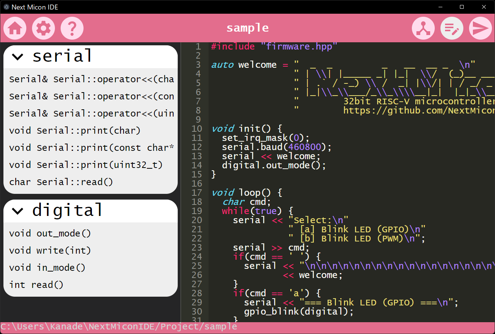

# Next Micon IDE





## Installation

### Ubuntu

**Install Appimage**

release から最新バージョンの NextMiconIDE.app をダウンロードし、インストールします。

**パッケージのダウンロード**

NextMiconのgithubリポジトリから、パッケージをダウンロードします。

```
$ cd
$ git clone [NextMicon/Registory] NextMiconIDE
```

**ツールチェーンのインストール**

`TinyFPGA_BX` 用のコンパイラやプログラマをインストールします。

```
$ cd ~/NextMiconIDE/Board/NextMicon/TinyFPGA_BX/0.0.0/
$ source install.sh
```

### Windows

未対応

### Mac

未対応

## チュートリアル

Ｌチカをします。

### 1. プロジェクトの作成

ホーム画面の一番左のボタン

### 2. ハードウェアの編集
